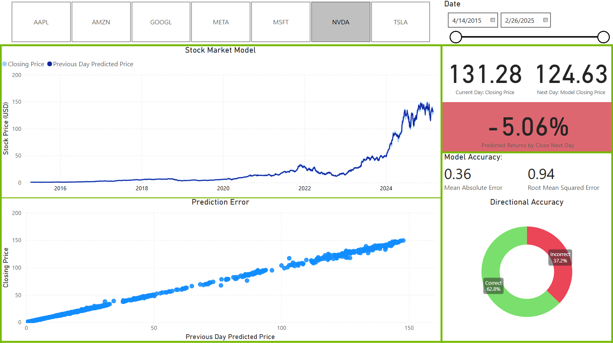
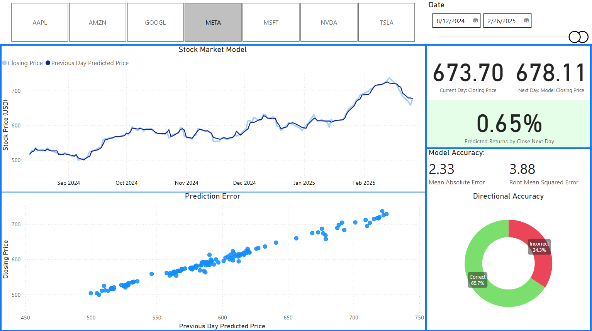

# Magnificent 7 Stock Price Prediction Dashboard

## Project Overview
This project involves the development of a stock price prediction model using historical stock data. It includes a Power BI dashboard that visualizes the model's predictions, evaluations, and comparisons with actual stock prices. The project aims to provide insights into stock price movements and help users understand predictive modeling in finance.

##Stocks
### The stocks used in this project are the following:
- AAPL
- AMZN
- GOOGL
- META
- MSFT
- NVDA
- TSLA

## Technologies Used
- Python
- Pandas
- Beautiful Soup
- Requests
- SQLAlchemy
- Psycopg2
- Scikit-learn
- Joblib
- Power BI

## Features
- **Data Extraction**:
  - Scrapes current stock data from Yahoo Finance.
  - Retrieves historical stock data from a CSV file available at [Kaggle: Magnificent 7 - Past 10 Years Prices](https://www.kaggle.com/datasets/unmoved/magnificent-7-past-10-years-prices-updated-daily).
- **Data Processing**: Cleans and prepares stock data for analysis and modeling.
- **Stores Data**: Stores all data in multiple SQL tables in a database.
- **Model Training**: Trains a Random Forest model to predict stock prices and saves to 
- **Model Evaluation**: Evaluates model performance using metrics such as Mean Squared Error (MSE) and R-squared values.
- **Interactive Dashboard**: A Power BI dashboard that displays:
  - Predicted vs. actual stock prices in a scatter plot, highlighting major outliers.
  - Colors change based on the stock symbol for better visualization.
  - Metrics indicating model performance for that stock.

## Demo Video
You can watch a quick demo video of the interactive dashboard below:


## Power BI Model Visualizations
### NVDA Prediction
- This shows the performance of the model for NVDA over the full data set


### Meta Prediction
- This shows the performance of the model for META over the last couple of months


## Usage
- **Running the Python Scripts**: 
   - The Python scripts can be run individually or Automatically using the "scheduler.py" file. Make sure to set up your SQL database and environment variables as described below.
   - The scripts are designed to run at specific times, and the pull from Yahoo Finance checks for business day close before execution.


## Installation 

1. **Prerequisites**  
   Ensure you have [Python](https://www.python.org/downloads/) (version 3.7 or higher) and Microsoft Power BI Desktop installed on your machine.

2. **Clone the Repository**  
   Open a terminal and run:
   ```bash
   git clone https://github.com/drewddudney/Mag7StockModel
   cd Mag7StockModel

3. **Install Dependencies**  
   Install the required Python libraries using pip:
   ```bash
   pip install -r requirements.txt

4. **Configure Environment Variables**  
   Set the following environment variables in your system to connect to the PostgreSQL database:
   ```bash
   setx DB_HOST "host"
   setx DB_PORT "port"
   setx DB_NAME "database"
   setx DB_USER "your_username"
   setx DB_PASSWORD "your_password"

5. **Download the most recent Dataset**  
   This can be found at [Kaggle: Magnificent 7 - Past 10 Years Prices](https://www.kaggle.com/datasets/unmoved/magnificent-7-past-10-years-prices-updated-daily).  
   Make sure to download the historical data up to the last business day for the web scraping to function properly.

6. **Open the Power BI Dashboard**  
   To open the Power BI dashboard:
   1. Open Microsoft Power BI Desktop.
   2. Click on `File` in the top left corner.
   3. Select `Open` and navigate to the directory where the `FinanceData.pbix` file is located.
   4. Select the `FinanceData.pbix` file and click `Open`.
   5. Once the dashboard loads, you can interact with it to visualize the stock predictions and performance metrics.

7. **Run the Scripts**  
   To run the main script(s) for data extraction and processing, execute:
   ```bash
   python scheduler.py

## License
This project is licensed under the MIT License. See the LICENSE file for details.

## Acknowledgments
- Inspired by various resources on stock price prediction and machine learning.
- Thanks to the contributors of the libraries used in this project as well as the Kaggle dataset creators.